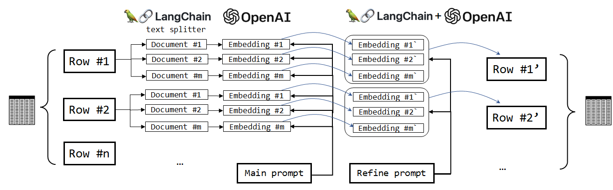

## PERSONALITY AND ITS TRANSFORMATIONS

> Professor Jordan Peterson's course on Personality and Its Transformations is an in-depth exploration of the nature of human personality, drawing from a diverse range of fields including psychology, neuroscience, and philosophy. The course examines how personality is shaped by both biology and environment, and how individuals can take practical steps to transform their own personalities. Through engaging lectures and thought-provoking discussions, students are challenged to question their assumptions about themselves and the world around them, and to develop a deeper understanding of what it means to be human.

The project focuses on [prof. Jordan Peterson's](https://pl.wikipedia.org/wiki/Jordan_Peterson) course [Personality and its Transformations](https://www.jordanbpeterson.com/classes/personality-and-its-transformations/).which lectures in video form can be accessed on YouTube. The course was taught in the past for multiple years:

2014 - https://www.youtube.com/watch?v=_0xBOMWJkgM&list=PLYNhvBtnVUK4mh5DYkwoekMunoVPRwXmP

2015 - https://www.youtube.com/watch?v=ZKpqpBRVr8Y&list=PLYNhvBtnVUK6Y4D_HWApBC9ZpaES4eobl

2016 - https://www.youtube.com/watch?v=UGLsnu5RLe8&list=PLYNhvBtnVUK4aUJ6onJbylGBeeqlJUpN1

2017 - https://www.youtube.com/watch?v=kYYJlNbV1OM&list=PLuqhl4iqeAZZA0YM-mHAV77VE6ZQjDRGr

2014 - 2017 - https://www.youtube.com/watch?v=_0xBOMWJkgM&list=PL22J3VaeABQBlN8DUor7SKWCwSghcqlY5

The project is based on the 2016 version of the lectures. More about prof. Peterson at this [link](https://www.jordanbpeterson.com/).

## The problem
Lecture material can be unstructured and unorganised. The lecturer following their train of thought can often digress from the main topic and implement side comments that can play an unstructured role in the overall lecture plan.
This project aims to make educational material more accessible by breaking down lecture texts into easily digestible pieces of information. Through a step-by-step approach, users can gradually build up their understanding of complex concepts without feeling overwhelmed. The project seeks to enhance the learning experience for students and provide them with a more structured way to engage with lecture material.

## Project outline
1. Download and preprocess Youtube Captions.
2. Prepare sentence embeddings.
3. Reduce dimensions and cluster vector representations.
4. Summarize each cluster using external tools (LangChain + OpenAI GPT).
5. Produce triples for knowledge graph.

## Project schema
The schema of the outline is presented below

### Notebook 1 and 2
TBA

### Notebook 3 and 4
TBA

### Notebook 5 and 6
Building a summary for each found cluster

