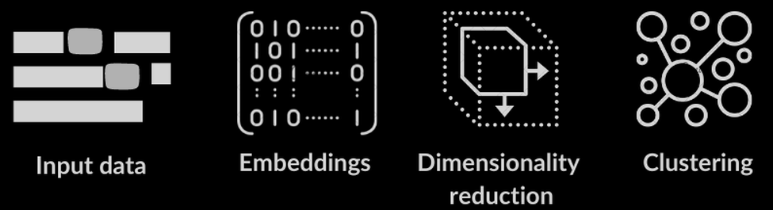

<!-- PROJECT LOGO -->
 

  

  <h3 align="center">Personality and Its Transformations</h3>

  

    Summary and knowledge destilation of prof. Jordan Peterson's YouTube lectures
     
    <a href="https://github.com/MariuszAndziak/Personality_and_Its_Transformations"><strong>Main Link»</strong></a>
     
     
    <a href="https://github.com/MariuszAndziak/Personality_and_Its_Transformations">Link 1</a>
    ·
    <a href="https://github.com/MariuszAndziak/Personality_and_Its_Transformations">Link 2</a>
    ·
    <a href="https://github.com/MariuszAndziak/Personality_and_Its_Transformations">Link 3</a>
  

## Notebook 01 · Get captions

## Notebook 02 · Split and Prepare sentences

## Notebook 03 · Create embeddings, reduce dimenstions and make clusters
